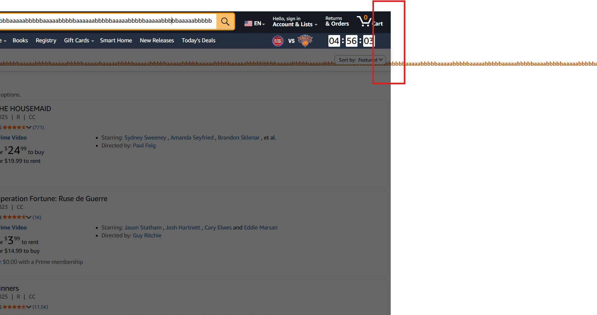
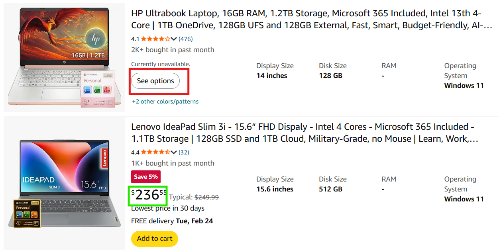

# Bug Report — Amazon Product Search

> **Note:** These are bugs and observations found during manual testing of product search flow on Amazon.

---
## BUG - 01: Horizontal Overflow Caused by Long Query Text

| Field | Value |
|---|---|
| **Title** | Results header does not wrap long query strings, causing horizontal page overflow |
| **Severity** | Low |
| **Category** | UI / Layout |
| **Steps to Reproduce** | 1. Go to amazon.com 2. Paste a string of 300+ characters into the search bar 3. Execute search 4. Observe the "1-48 of over X results for..." section |
| **Expected Result** | The search query text should wrap to a new line or be truncated to fit within the viewport width without affecting the page scroll |
| **Actual Result** | The query text remains in a single line, extending beyond the standard page width. While other UI elements (like product cards) remain intact, the page develops a horizontal scrollbar to accommodate the overflowing text |
| **Impact** | Minor UX issue. It creates an unnecessary horizontal scrollbar which is inconsistent with the rest of the site's vertical-only navigation. |

---

## Observation - 01: Some Products Display "See options" Instead of Actual Price

| Field | Value |
|---|---|
| **Title** | Products with hidden prices show "See options" instead of a visible price |
| **Severity** | Medium |
| **Category** | Data Consistency |
| **Steps to Reproduce** | 1. Go to amazon.com 2. Search for any popular product (e.g.,"laptop") 3. Scroll through results |
| **Expected Result** | All product listings display a visible price so users can compare products without additional clicks |
| **Actual Result** | Some products show "See options" or no price at all, making comparison impossible from the search results page |
| **Impact** | Users cannot make informed purchase decisions from the search page. |

---

## Observation - 02: Sponsored Products Mixed with Organic Results Without Clear Separation

| Field | Value |
|---|---|
| **Title** | Sponsored products are interspersed with organic results with minimal visual distinction |
| **Severity** | Low |
| **Category** | Usability |
| **Steps to Reproduce** | 1. Go to amazon.com 2. Search for any popular product (e.g., "laptop") 3. Observe the first few results |
| **Expected Result** | Sponsored products should be clearly distinguished from organic results (e.g., separate section, prominent label) |
| **Actual Result** | Sponsored products appear inline with organic results. The "Sponsored" label is small and easily overlooked |
| **Impact** | May mislead users into thinking sponsored products are the most relevant results. |

---